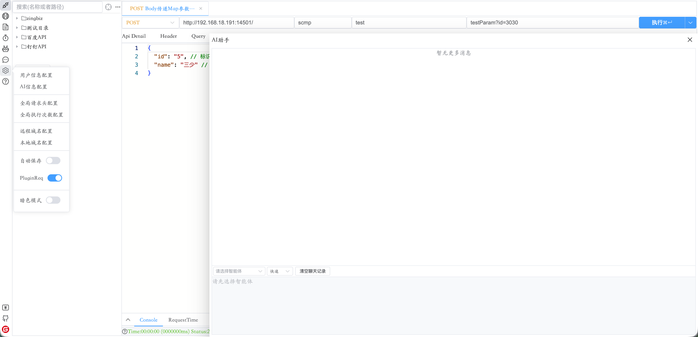

> 浏览器端团队 API 平台：**测接口、写文档、定时调度、群聊与 AI** 一体。

---

# 产品概览

**NBA-API** 面向开发、测试、产品团队，在浏览器内完成接口调试、文档协作、定时巡检与轻量群聊协作，支持内网私有化部署以及本地化部署。

## 核心能力

| 模块 | 要点 |
|------|------|
| **API 管理** | HTTP / SSE(POST/GET) / WebSocket、RESTFUL、Fetch 导入、JSON5、脚本、并发 N 次、顺序/并行执行、版本快照、分享 |
| **组合文档** | 多接口业务流程说明、协同编辑、分享 / 下载 |
| **定时任务** | CRON / RRULE / 时间戳，直接关联 API |
| **群聊与 AI** | 实时群聊；群内 `@本地AI`、本机会话、发送到群；DeepSeek / 千问 / 千帆 / 本地模型，密钥仅存本机 |
| **配置** | 用户名与角色、全局 Header、远程/本地域名、PluginReq、自动保存 |

## 产品亮点

1. **PluginReq — 远程页面直连本机服务**
   > 工具部署在内网/远程服务器，目标 API 在开发者本机 `localhost` / `127.0.0.1` 时，安装篡改猴插件并开启 PluginReq，请求由浏览器插件从本机发出，无需 Postman 客户端或额外代理。适合「工具服务器与 API 不在同一网段、但 PC 能访问目标服务」的联调场景（仅 HTTP，WebSocket 浏览器直连）。

2. **全协议接口测试 — HTTP(S) / SSE / WS(S) 一站覆盖**
   > 支持 GET / POST / PUT / DELETE 及 RESTFUL 路径参数（如 `/user/{id}`）；SSE 流式实时查看 ResponseData；WebSocket 连接、子协议、Query 鉴权、Message 多格式收发。Body 支持 JSON5、multipart、表单；文件下载可「点我保存」。

3. **测 · 写 · 跑 · 群聊 AI — 侧栏闭环**
   > **测**：目录树、多标签、域名 Context-Path / Prefix / Path 拼接。  
   > **写**：单接口预览、多 API 组合文档（协同 / 分享 / 下载）。  
   > **跑**：定时任务 CRON / RRULE / 时间戳关联 API 巡检。  
   > **群聊 AI**：侧栏进入群聊；`@本地AI` 本机多轮，需要时「发送到群」；密钥仅存本机。

4. **分享零安装 + 多端实时协同**
   > 单个 / 批量 / 已打开标签均可生成分享链接，接收方浏览器打开即测。远程 API 多人编辑时，保存方更新后其他端标签旁出现同步图标。组合文档支持多人协同（先配置用户名）。

5. **远程 + 本地双库，协作与隐私兼顾**
   > **远程 API** 存服务器，团队共享。**本地 API**（橘黄色）仅本机。**远程域名** 团队共享；**本地域名** 仅本机；**全局请求头** 本机缓存、同名优先于局部 Header。

6. **批量压测与流程编排**
   > 单接口「执行 N 次」；多标签顺序执行或并行执行（自动跳过 WS / SSE）。RequestTime 折线图；响应头可右键回填 Header。

7. **Java(<=8) Code 直转文档**
   > Copy as fetch → FetchCode To API。上传 Java（Swagger 注解）生成字段文档，**To Body Param** 生成 JSON 示例。

8. **脚本预处理 + 版本快照**
   > `buildParam` / `buildMessage` 动态改写参数或消息；版本快照最多 30 条可回滚；自动保存开启后请求成功即更新有编辑的 API。

9. **开箱即用的团队配置**
   > 用户名与角色、全局执行次数、全局 Header、远程/本地域名、PluginReq、自动保存集中在齿轮；API 树拖拽、搜索、目录继承 Context-Path 与 Prefix。

## 与主流工具对比

> 对比 **Postman · Apifox · Insomnia · Swagger/Knife4j · YApi**　｜　✅ 较好　⚠️ 部分　❌ 不支持

| 能力 | NBA-API | 主流工具常见情况 |
|------|:-------:|------------------|
| HTTP / SSE / WebSocket | ✅ / ✅ / ✅ | HTTP 普遍；SSE/WS 因工具而异 |
| 浏览器在线 + 私有化部署 | ✅ | Postman/Apifox 私有化多为企业版 |
| 组合文档 + 协同编辑 | ✅ | Swagger/YApi 偏只读或弱协同 |
| 定时调度 API | ✅ | 多数需 Monitor 付费或另写脚本 |
| 远程页面测本机 localhost | ✅ PluginReq | 通常需本地客户端或代理 |
| 本地私密 API（不上云） | ✅ | 较少支持 |
| 群聊 + 本机 AI 协作 | ✅ | 多数不内置或需另装 |
| Fetch 一键导入 | ✅ | 多数不支持 |
| Mock / CI 集成 | ❌ | Postman / Apifox 更强 |

# 截图概览




# 部署

## 下载资源

> 从[https://github.com/fushengruomengzhang/API-scmp](https://github.com/fushengruomengzhang/API-scmp)  
> 或者[https://gitee.com/fusheng_zhang/API-scmp](https://gitee.com/fusheng_zhang/API-scmp)下载,  
> 从source目录获取资源,包含 scmp.jar lib/other/*.jar sqlit-db.db static

## 启动脚本

> jdk8

```shell
java -jar scmp.jar \
	--db.type=sqlit --sqlit.path=./sqlit-db.db \ # 配置为你的 sqlite-db.db 路径（文件名以包内为准）
	--project.location-file-path=file:./static/ \ # 配置为你的static目录路径
	--project.socket.ports=3501 \ # webSocket 端口配置
	--spring.profiles.active=pro >/dev/null 2>&1 & # 如果要控制台启动，可以不使用这一行，同时注意去掉上一行结果的反斜杠/
```

```batch
java -jar .\scmp.jar --db.type=sqlit --sqlit.path=./sqlit-db.db --project.location-file-path=file:./static/
```

# 数据库

> 当前提供的所有代码,也可以在服务器部署,使用的数据库是sqlite.同时也支持mysql8数据库,比sqlite稳定,需要的同我联系  
> 邮箱：17610759800@163.com qq:1270622569 微信: zfs1270622569

## 访问

[http://127.0.0.1:3500/scmp/static/index.html#/request/api](http://127.0.0.1:3500/scmp/static/index.html#/request/api)

# 试用地址

[http://182.92.210.97/scmp/static/index.html#/request/api](http://182.92.210.97/scmp/static/index.html#/request/api)

# 使用文档

[使用文档](USER_GUIDE.md)

# 感谢打赏


