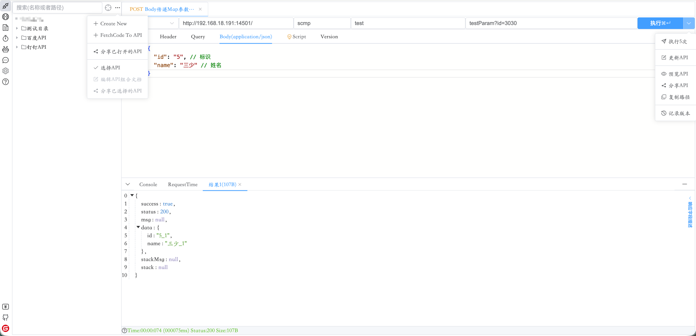
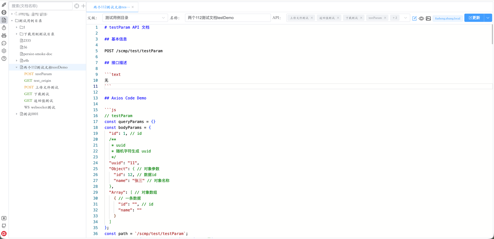
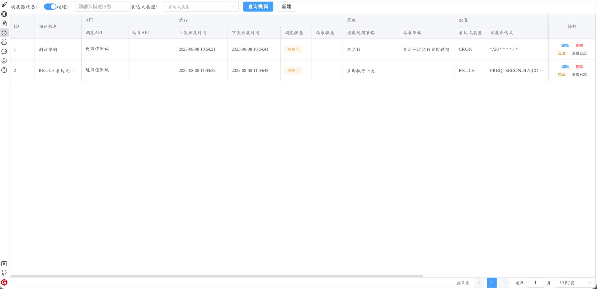
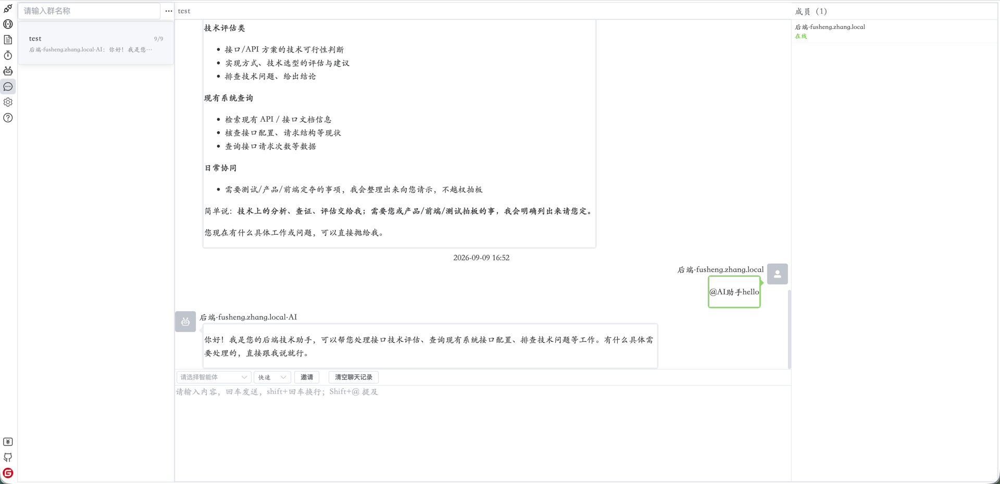
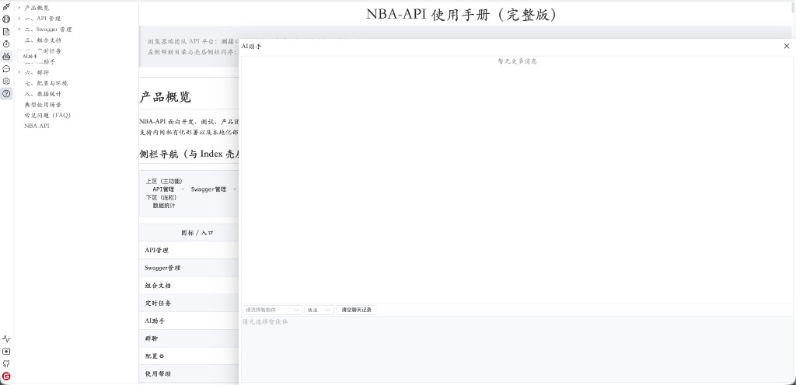
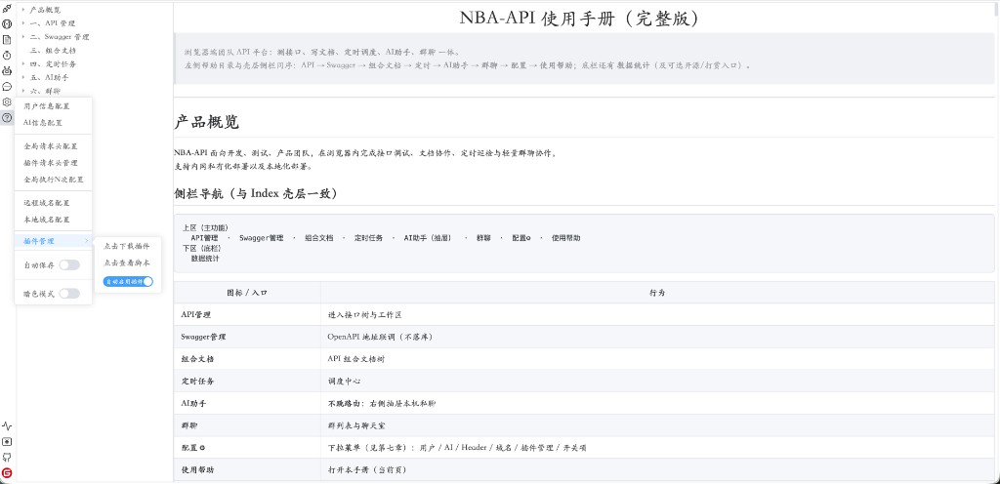

> 浏览器端团队 API 平台：**测接口、写文档、定时调度、AI助手、群聊** 一体。  
> 左侧帮助目录与壳层侧栏同序：API → Swagger → 组合文档 → 定时 → **AI助手** → **群聊** → **配置** → **使用帮助**；底栏还有 **数据统计**。

---

# 产品概览

**NBA-API** 面向开发、测试、产品团队，在浏览器内完成接口调试、文档协作、定时巡检与轻量群聊协作，  
支持内网私有化部署以及本地化部署。

## 侧栏导航（与 Index 壳层一致）

```
上区（主功能）
  API管理  ·  Swagger管理  ·  组合文档  ·  定时任务  ·  AI助手（抽屉）  ·  群聊  ·  配置⚙  ·  使用帮助
下区（底栏）
  数据统计
```

| 图标 / 入口 | 行为 |
|-----------|------|
| **API管理** | 进入接口树与工作区 |
| **Swagger管理** | OpenAPI 地址联调（不落库） |
| **组合文档** | API 组合文档树 |
| **定时任务** | 调度中心 |
| **AI助手** | **不跳路由**：右侧抽屉本机私聊 |
| **群聊** | 群列表与聊天室 |
| **配置 ⚙** | **下拉菜单**：用户 / AI / Header / 域名 / 插件管理 / 开关项 |
| **使用帮助** | 打开使用手册 |
| **数据统计** | 近 30 天 API / 组合文档新增柱状图（需远程服务） |

**壳层行为（重要）：**

| 情况 | 表现 |
|------|------|
| **远程服务不通** | 仅 **API管理**、**Swagger管理** 可进；点组合文档 / 定时 / 群聊 / 数据统计会提示「远程服务不可用」 |
| **有未保存修改时离开** | 从 API管理 / 组合文档 / Swagger管理 切走时，若有未保存编辑会确认「离开将丢弃」 |
| **AI 抽屉** | `modal` 可穿透，测接口时可同时开着抽屉 |

## 核心能力

| 模块 | 要点 |
|------|------|
| **API 管理** | HTTP / SSE / WebSocket、RESTFUL、Fetch 导入、JSON5、脚本、并发 N 次（结果 Tab）、顺序/并行执行、版本快照、分享 |
| **Swagger 管理** | 填 OpenAPI / Swagger 地址 → 左树点接口 → 右侧执行；不写入 API 库 |
| **组合文档** | 多接口业务流程说明、协同编辑、分享 / 下载 |
| **定时任务** | CRON / RRULE / 时间戳，直接关联 API |
| **AI助手** | 侧栏机器人抽屉：本机私聊；DeepSeek / 千问 / 千帆 / 本地模型；密钥仅存本机 |
| **群聊** | 实时群聊、邀请/踢人；群内亦可 `@AI助手`、发送到群 |
| **配置** | ⚙ 下拉：用户 / AI / Header / 执行次数 / 域名；**插件管理**（下载插件·查看脚本·自动启用）；自动保存 / 暗色模式 |
| **数据统计** | API、组合文档近 30 天每日新增（柱状图） |

## 产品亮点

1. **「自动启用插件」— 远程页面直连本机服务**
   > 工具部署在内网/远程服务器，目标 API 在开发者本机 `localhost` / `127.0.0.1` 时，安装篡改猴后：齿轮 → **插件管理** → 打开「自动启用插件」，本机地址的 HTTP 会自动经浏览器插件发出，无需额外代理。也可在单个 API 的 Api Detail 打开「使用插件」强制代发。**仅 HTTP；WebSocket 始终浏览器直连**。

2. **全协议接口测试 — HTTP(S) / SSE / WS(S) 一站覆盖**
   > 支持 GET / POST / PUT / DELETE 及 RESTFUL 路径参数（如 `/user/{id}`）；SSE 流式在「结果 N」的 **Data** 中实时更新；WebSocket 连接、子协议、Query 鉴权、Message 多格式收发。Body 支持 JSON5、multipart、表单；文件下载可「点我保存」。

3. **测 · 写 · 跑 · AI · 群 — 侧栏闭环**
   > **测**：目录树、多标签、域名 Context-Path / Prefix / Path 拼接。  
   > **写**：单接口预览、多 API 组合文档（协同 / 分享 / 下载）。  
   > **跑**：定时任务 CRON / RRULE / 时间戳关联 API 巡检。  
   > **AI助手**：侧栏机器人开本机抽屉（不问群）。  
   > **群聊**：侧栏气泡进群；需要时 `@AI助手` 多轮再「发送到群」。  
   > **配置 / 帮助 / 统计**：齿轮下拉管环境；问号进手册；底栏看近 30 天新增。

4. **分享零安装 + 多端实时协同**
   > 单个 / 批量 / 已打开标签均可生成分享链接，接收方浏览器打开即测。远程 API 多人编辑时，保存方更新后其他端标签旁出现同步图标。组合文档支持多人协同（先配置用户名）。

5. **远程 + 本地双库，协作与隐私兼顾**
   > **远程 API** 存服务器，团队共享。**本地 API**（橘黄色）仅本机。**远程域名** 团队共享；**本地域名** 仅本机；**全局请求头** 本机缓存，同名时优先于局部 Header 和插件请求头。**插件请求头** 用同一套篡改猴脚本从目标网站抓取。

6. **批量压测与流程编排**
   > 单接口「执行 N 次」，每次对应一个可关闭的「结果 N」；多标签顺序执行或并行执行（自动跳过 WS / SSE）。RequestTime 折线图；结果 Tab 的 Header 视图可右键回填请求头。

7. **直转文档**
   > Fetch 请求转换：Copy as fetch → FetchCode To API。上传 Java（Swagger 注解）生成字段文档，**To Body Param** 生成 JSON 示例。

8. **脚本预处理 + 版本快照**
   > `getVersion` / `buildParam` / `buildMessage` 动态改写参数或消息；Console 终端可看脚本日志；版本快照回滚；自动保存开启后请求成功即更新有编辑的 API。

9. **Swagger 管理 — 不入库**
   > 侧栏进入 Swagger 管理：填服务的 Swagger UI / docs 地址并加载，展开分组后点操作即可在右侧执行、看「结果 N」。适合对照现网 OpenAPI 临时联调；不会保存进 API 管理树。

10. **开箱即用的团队配置**
   > 用户名与角色、**AI 信息（密钥 / 本地地址）**、全局执行次数、全局 Header、插件请求头、远程/本地域名、**插件管理**（下载 CRX / 查看脚本 / 自动启用插件）、自动保存、暗色模式集中在侧栏齿轮下拉。

## 与主流工具对比

> 对比 **Postman · Apifox · Insomnia · Swagger/Knife4j · YApi**　｜　✅ 较好　⚠️ 部分　❌ 不支持

| 能力 | NBA-API | 主流工具常见情况 |
|------|:-------:|------------------|
| HTTP / SSE / WebSocket | ✅ / ✅ / ✅ | HTTP 普遍；SSE/WS 因工具而异 |
| 浏览器在线 + 私有化部署 | ✅ | Postman/Apifox 私有化多为企业版 |
| 组合文档 + 协同编辑 | ✅ | Swagger/YApi 偏只读或弱协同 |
| 定时调度 API | ✅ | 多数需 Monitor 付费或另写脚本 |
| 远程页面测本机 localhost | ✅「自动启用插件」 | 通常需本地客户端或代理 |
| 本地私密 API（不上云） | ✅ | 较少支持 |
| 群聊 + 本机 AI 协作 | ✅ | 多数不内置或需另装 |
| 独立 AI 助手入口 | ✅ | 多数需另开产品或插件 |
| Fetch 一键导入 | ✅ | 多数不支持 |
| Mock / CI 集成 | ❌ | Postman / Apifox 更强 |

# 截图概览








# 部署

## 下载资源

> 从[https://github.com/fushengruomengzhang/API-scmp](https://github.com/fushengruomengzhang/API-scmp)  
> 或者[https://gitee.com/fusheng_zhang/API-scmp](https://gitee.com/fusheng_zhang/API-scmp)下载,  
> 从source目录获取资源,包含 scmp.jar lib/other/*.jar sqlit-db.db static

## 启动脚本

> jdk8

```shell
java -jar scmp.jar \
	--db.type=sqlit --sqlit.path=./sqlit-db.db \ # 配置为你的 sqlite-db.db 路径（文件名以包内为准）
	--project.location-file-path=file:./static/ \ # 配置为你的static目录路径
	--project.socket.ports=3501 \ # webSocket 端口配置
	--spring.profiles.active=pro >/dev/null 2>&1 & # 如果要控制台启动，可以不使用这一行，同时注意去掉上一行结果的反斜杠/
```

```batch
java -jar .\scmp.jar --db.type=sqlit --sqlit.path=./sqlit-db.db --project.location-file-path=file:./static/
```

# 数据库

> 当前提供的所有代码,也可以在服务器部署,使用的数据库是sqlite.同时也支持mysql8数据库,比sqlite稳定,需要的同我联系  
> 邮箱：17610759800@163.com qq:1270622569 微信: zfs1270622569

## 访问

[http://127.0.0.1:3500/scmp/static/index.html#/request/api](http://127.0.0.1:3500/scmp/static/index.html#/request/api)

# 试用地址

[http://182.92.210.97/scmp/static/index.html#/request/api](http://182.92.210.97/scmp/static/index.html#/request/api)

# 使用文档

[使用手册（完整版）](USER_GUIDE.md)

# 感谢打赏


